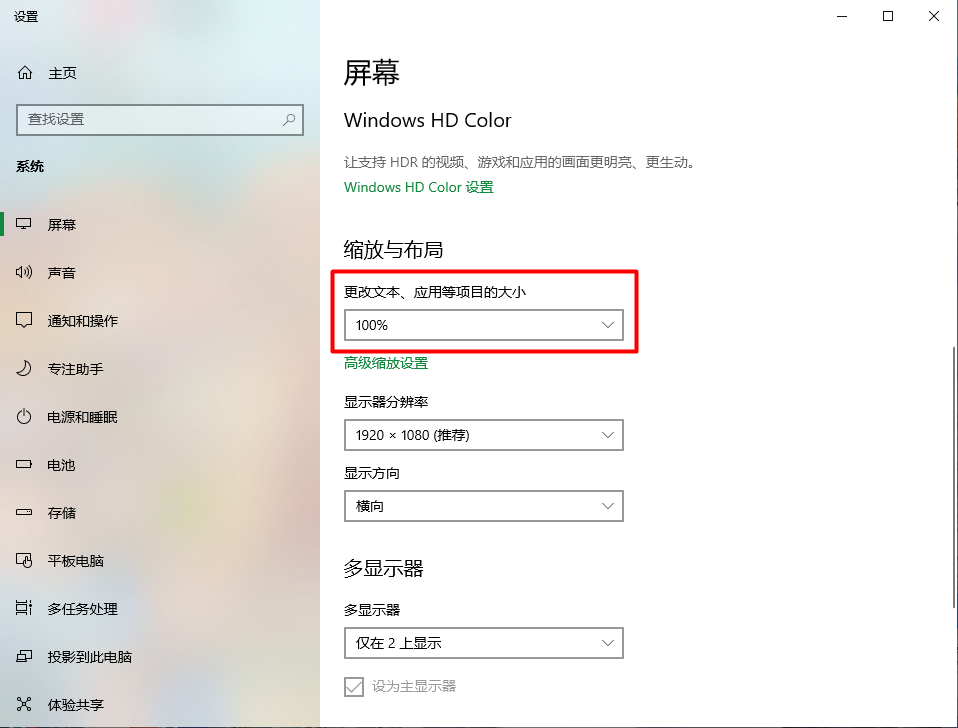
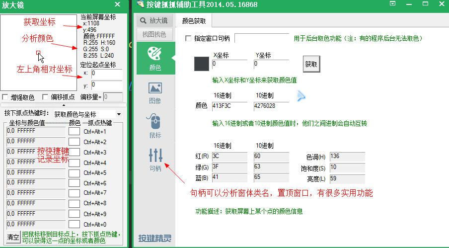

# goOpenCv

## 注意事项

屏幕缩放后计算像素会不准,因此需要按下图设置,这样打开图片选择`1:1`时计算像素才准确



我放了一个按键精灵分析屏幕坐标的工具，里面功能都相当强大，对图片找偏移位置很有帮助

[按键精灵计算坐标工具](Picker.7z)



## 介绍
本项目使用 [gocv](https://gocv.io/) , [github](https://github.com/hybridgroup/gocv) ,通过图像识别玩游戏

## 安装教程

### 使用已有依赖

准备gocv环境

可以下我编译的: [下载地址](https://github.com/jan-bar/goOpenCv/releases/download/4.10.0/opencv.7z)

解压后建立c盘链接: `mklink /j c:\opencv xxx\opencv`

### 手动编译依赖

[文档](https://gocv.io/getting-started/windows/)

下载gcc环境: [下载地址](https://sourceforge.net/projects/mingw-w64/files/),选择最新版`x86_64-posix-seh`

下载cmake: [下载地址](https://cmake.org/download/),可以选择zip免安装版本

然后根据脚本进行编译: [编译脚本](https://github.com/hybridgroup/gocv/blob/release/win_build_opencv.cmd)

`set http_proxy=127.0.0.1:1080 & set https_proxy=127.0.0.1:1080` 设置代理中途需要下载GitHub资源

`wget https://github.com/opencv/opencv/archive/4.7.0.zip -O opencv-4.7.0.zip` 解压到当前目录

`wget https://github.com/opencv/opencv_contrib/archive/4.7.0.zip -O opencv_contrib-4.7.0.zip` 解压到当前目录

最好执行`mklink /j c:\opencv xxx\opencv`,保证脚本使用都是`c:\opencv`路径,包括gcc和cmake工具

`set enable_shared=ON` 使用动态dll编译,记得cmake命令里面几个路径改为自己需要的

`set enable_shared=OFF` 使用静态编译,记得cmake命令里面几个路径改为自己需要的

编译完成后将`install`路径按照gocv要求弄好,做个压缩包存起来也可以

注意编译出来的可执行程序还依赖`libwinpthread-1.dll,libstdc++-6.dll,libgcc_s_seh-1.dll`这3个dll,一般安装window的git就有

不然还得将上面解压的gcc环境里的这3个dll路径添加到PATH环境变量中

使用`msys2`编译
```shell
# 在UCRT64终端,安装必要软件和编译环境
pacman -S mingw-w64-ucrt-x86_64-cmake mingw-w64-ucrt-x86_64-gcc mingw-w64-ucrt-x86_64-7zip mingw-w64-ucrt-x86_64-make
# 准备编译目录
rm -rf /c/opencv
mkdir -p /c/opencv/build
# 下载opencv和opencv_contrib,有需要可设置代理
#export https_proxy=127.0.0.1:1080
wget https://github.com/opencv/opencv/archive/4.10.0.zip -O /c/opencv/opencv.zip
wget https://github.com/opencv/opencv_contrib/archive/4.10.0.zip -O /c/opencv/opencv_contrib.zip
# 解压
7z x /c/opencv/opencv.zip -o/c/opencv
7z x /c/opencv/opencv_contrib.zip -o/c/opencv

cd /c/opencv/build
# 编译动态库
cmake /c/opencv/opencv-4.10.0 -G "MinGW Makefiles" -B/c/opencv/build -DENABLE_CXX11=ON -DOPENCV_EXTRA_MODULES_PATH=/c/opencv/opencv_contrib-4.10.0/modules -DBUILD_SHARED_LIBS=ON -DWITH_IPP=OFF -DWITH_MSMF=OFF -DBUILD_EXAMPLES=OFF -DBUILD_TESTS=OFF -DBUILD_PERF_TESTS=ON -DBUILD_opencv_java=OFF -DBUILD_opencv_python=OFF -DBUILD_opencv_python2=OFF -DBUILD_opencv_python3=OFF -DBUILD_DOCS=OFF -DENABLE_PRECOMPILED_HEADERS=OFF -DBUILD_opencv_saliency=OFF -DBUILD_opencv_wechat_qrcode=ON -DCPU_DISPATCH= -DOPENCV_GENERATE_PKGCONFIG=ON -DWITH_OPENCL_D3D11_NV=OFF -DOPENCV_ALLOCATOR_STATS_COUNTER_TYPE=int64_t -Wno-dev
mingw32-make -j$(nproc) && mingw32-make install
# 压缩编译好的文件
mkdir -p opencv/build
ln -sf /c/opencv/build/install opencv/build/install
7z a /c/opencv/opencv.7z opencv/build/install
```

## 相关项目
每个项目都有`build.bat`编译脚本,会设置`opencv`相关dll的路径到`$PATH`环境变量中

查看具体项目说明,了解具体玩法

[连连看](LianLianKan/README.md)

[麻将](mahjong/README.md)

