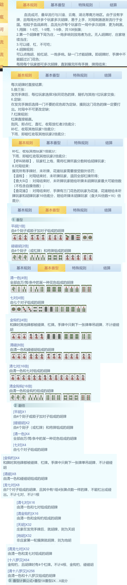
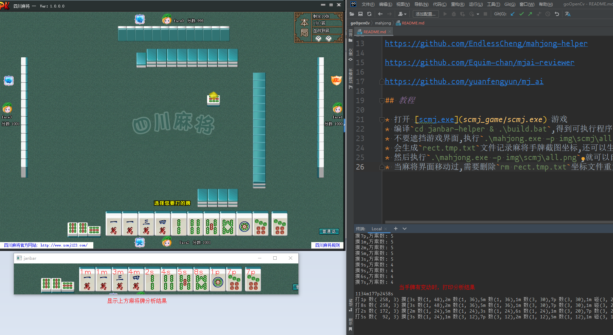
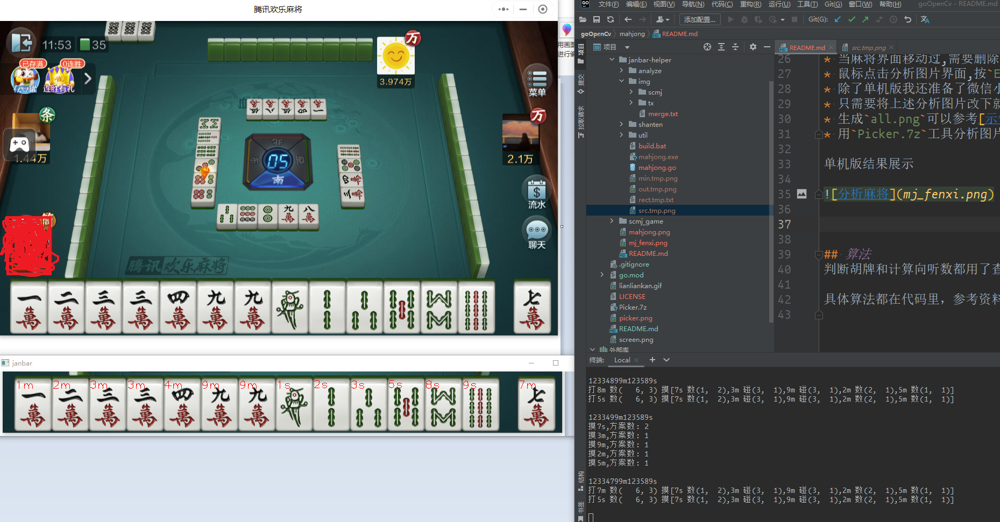

## 四川麻将规则
这里是找的腾讯欢乐麻将小程序里面`血流成河`的规则

这里有个四川麻将单机版: [mahjong](scmj_game/scmj.exe)

相关资料链接

https://github.com/simonlu9/majiang

https://github.com/EndlessCheng/mahjong-helper

https://github.com/Equim-chan/mjai-reviewer

https://github.com/yuanfengyun/mj_ai

## 教程

* 打开 [scmj.exe](scmj_game/scmj.exe) 游戏
* 编译`cd janbar-helper & .\build.bat`,得到可执行程序
* 不要遮挡游戏界面,执行`.\mahjong.exe -p img\scmj\all.png -m`
* 会生成`rect.tmp.txt`文件记录麻将手牌截图坐标,还可以生成几张图片参考
* 然后执行`.\mahjong.exe -p img\scmj\all.png`,就可以自动截图分析麻将
* 当麻将界面移动过,需要删除`rm rect.tmp.txt`坐标文件重复上面生成坐标命令
* 鼠标点击分析图片界面,按`Esc`就可以退出程序
* 除了单机版我还准备了微信小程序`腾讯麻将`的截图分析
* 只需要将上述分析图片改下就行`.\mahjong.exe -p img\tx\all.png -m`
* 生成`all.png`可以参考[示例代码](janbar-helper/img/merge.txt)
* 用`Picker.7z`工具分析图片方便快捷

单机版结果展示

腾讯麻将小程序结果展示

## 算法
判断胡牌和计算向听数都用了查表法,相当快速。不过我也写了一般方案的判断胡牌和计算向听数，大家可以参考。

具体算法都在代码里，参考资料也都在注释里面，大家可以自己学习
